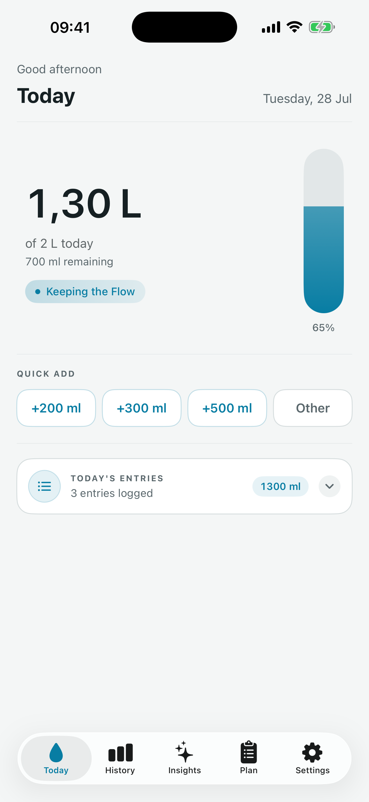

# AquaFlow

AquaFlow is a native iOS hydration tracker designed to make daily water intake simple, adaptive, and private. It combines quick logging, progress history, personalized hydration plans, on-device insights, widgets, Live Activities, and App Intents in a SwiftUI app.



## Features

- Quick water logging with configurable amounts
- Daily goal progress and hydration history
- Adaptive plans that react to the user's active hours and recorded intake
- On-device insights powered by Apple's Foundation Models
- Deterministic plan fallback when the on-device language model is unavailable
- Home Screen widget and Live Activity
- App Intents for Shortcuts and Siri
- Metric and US customary volume units
- Light and dark appearances
- Local persistence with SwiftData and a shared App Group container

> AquaFlow supports hydration habit tracking and does not provide medical advice.

## Tech stack

- Swift and SwiftUI
- SwiftData
- Foundation Models
- WidgetKit and ActivityKit
- App Intents
- XCTest

## Requirements

- macOS with Xcode 26 or later
- iOS 26 or later
- An Apple Developer team for running App Group, widget, and Live Activity capabilities on a physical device
- An Apple Intelligence-compatible device with Apple Intelligence enabled for generated insights; core tracking and deterministic planning remain available without it

## Getting started

1. Clone the repository:

   ```bash
   git clone git@github.com:rafael-toneto/Aqua.git
   cd Aqua
   ```

2. Open `Aqua.xcodeproj` in Xcode.

3. Select the `AquaFlow` scheme and an iOS 26 simulator or device.

4. If you use a different Apple Developer account, update the development team and bundle identifiers for the app and widget targets. Create an App Group for both targets and update `AquaSharedStore.appGroupIdentifier` plus the two entitlement files to use the same identifier.

5. Build and run with `⌘R`.

No third-party dependencies or API keys are required.

## Running tests

Run the test suite from Xcode with `⌘U`, or from the command line after selecting a full Xcode installation:

```bash
xcodebuild test \
  -project Aqua.xcodeproj \
  -scheme AquaFlow \
  -destination 'platform=iOS Simulator,name=iPhone 17 Pro'
```

If that simulator is not installed, replace the destination with one listed by:

```bash
xcrun simctl list devices available
```

## Project structure

```text
Aqua/
├── App/             App entry point and dependency composition
├── AppIntents/      Siri and Shortcuts actions
├── Data/            SwiftData repositories and preferences
├── DesignSystem/    Reusable visual tokens and components
├── Domain/          Models, services, planning, and insights logic
├── Features/        SwiftUI screens and view models
├── Intelligence/    Foundation Models integrations
└── LiveActivity/    Live Activity coordination
AquaShared/          Models and storage shared with extensions
AquaWidgets/         Widget and Live Activity extension
AquaTests/           Unit and presentation tests
AppStore/            App Store screenshots
```

## Privacy

Hydration entries and preferences are stored locally in the app's shared container. Foundation Models inference runs on device; the repository does not require a remote backend or analytics SDK.

## Contributing

Before opening a pull request, build the `AquaFlow` scheme and run the full test suite. Keep user-specific Xcode data, signing assets, build output, and secrets out of commits; the repository's `.gitignore` covers the common cases.

## License

No open-source license has been added yet. All rights are reserved by the repository owner unless a license is provided later.
